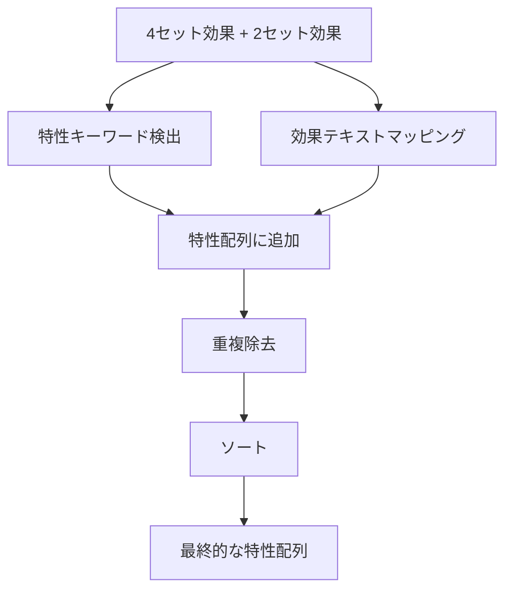

# Design Document

## Overview

ドライバディスクの`specialty`フィールドを単一値から配列形式に変更し、4 セット効果と 2 セット効果のテキストから複数の特性を抽出する機能を実装します。これにより、複数の特性に対応するドライバディスクを正確に表現できるようになります。

## Architecture

### 影響を受けるコンポーネント

1. **型定義** (`src/types/index.ts`)

   - `DriverDisc`型の`specialty`フィールドを`Specialty`から`Specialty[]`に変更

2. **データマッパー** (`src/mappers/DriverDiscDataMapper.ts`)

   - 特性抽出ロジックを拡張し、複数の特性を配列として返すように変更
   - 効果テキストベースのマッピングルールを実装

3. **ジェネレーター** (`src/generators/DriverDiscGenerator.ts`)

   - 配列形式の`specialty`フィールドを正しく出力するように変更
   - バリデーションロジックを配列形式に対応

4. **データファイル** (`data/driverDiscs.ts`)
   - 既存の全てのドライバディスクデータを配列形式に変換

## Components and Interfaces

### 1. 型定義の変更

#### 変更前

```typescript
type DriverDisc = {
  id: number;
  name: { [key in Lang]: string };
  fourSetEffect: { [key in Lang]: string };
  twoSetEffect: { [key in Lang]: string };
  releaseVersion: number;
  specialty: Specialty; // 単一値
};
```

#### 変更後

```typescript
type DriverDisc = {
  id: number;
  name: { [key in Lang]: string };
  fourSetEffect: { [key in Lang]: string };
  twoSetEffect: { [key in Lang]: string };
  releaseVersion: number;
  specialty: Specialty[]; // 配列形式
};
```

### 2. DriverDiscDataMapper の拡張

#### 新しいメソッド: `extractSpecialties`

```typescript
/**
 * 4セット効果と2セット効果テキストから特性配列を抽出
 * @param fourSetEffect 4セット効果のテキスト
 * @param twoSetEffect 2セット効果のテキスト
 * @returns 抽出された特性の配列（重複なし）
 */
public extractSpecialties(
  fourSetEffect: string,
  twoSetEffect: string
): Specialty[]
```

#### 特性抽出ルール

1. **特性キーワードの検出**

   - `[撃破]` → `stun`
   - `[強攻]` → `attack`
   - `[異常]` → `anomaly`
   - `[支援]` → `support`
   - `[防護]` → `defense`
   - `[命破]` → `rupture`

2. **効果テキストベースのマッピング**

| 効果テキスト                   | 対応する特性             |
| ------------------------------ | ------------------------ |
| エネルギー自動回復             | support                  |
| 会心率                         | attack                   |
| 貫通率                         | attack, support, anomaly |
| 異常マスタリー                 | anomaly                  |
| 攻撃力                         | attack, support, anomaly |
| 防御力                         | defense                  |
| 炎属性ダメージ                 | attack, anomaly, stun    |
| エーテル属性ダメージ           | attack, anomaly, stun    |
| 電気属性ダメージ               | attack, anomaly, stun    |
| 氷属性ダメージ                 | attack, anomaly, stun    |
| 物理属性ダメージ               | attack, anomaly, stun    |
| シールド生成量                 | defense                  |
| 会心ダメージ                   | attack, anomaly          |
| 異常掌握                       | anomaly, support         |
| 『追加攻撃』と『ダッシュ攻撃』 | attack, stun             |
| HP                             | rupture                  |
| 攻撃の与えるブレイク値         | stun, support            |

#### 実装の詳細

```typescript
private static readonly EFFECT_SPECIALTY_MAPPING: Record<string, Specialty[]> = {
  'エネルギー自動回復': ['support'],
  '会心率': ['attack'],
  '貫通率': ['attack', 'support', 'anomaly'],
  '異常マスタリー': ['anomaly'],
  '攻撃力': ['attack', 'support', 'anomaly'],
  '防御力': ['defense'],
  '炎属性ダメージ': ['attack', 'anomaly', 'stun'],
  'エーテル属性ダメージ': ['attack', 'anomaly', 'stun'],
  '電気属性ダメージ': ['attack', 'anomaly', 'stun'],
  '氷属性ダメージ': ['attack', 'anomaly', 'stun'],
  '物理属性ダメージ': ['attack', 'anomaly', 'stun'],
  'シールド生成量': ['defense'],
  '会心ダメージ': ['attack', 'anomaly'],
  '異常掌握': ['anomaly', 'support'],
  '『追加攻撃』と『ダッシュ攻撃』': ['attack', 'stun'],
  'HP': ['rupture'],
  '攻撃の与えるブレイク値': ['stun', 'support'],
};
```

#### 処理フロー



### 3. DriverDiscGenerator の変更

#### 変更点

1. **`formatDriverDiscObject`メソッドの更新**
   - `specialty`フィールドを配列形式で出力

```typescript
// 変更前
specialty: "${driverDisc.specialty}",

// 変更後
specialty: [${driverDisc.specialty.map(s => `"${s}"`).join(', ')}],
```

2. **`validateDriverDisc`メソッドの更新**
   - 配列形式の検証ロジックを追加

```typescript
// 配列の検証
if (!Array.isArray(driverDisc.specialty)) {
  errors.push("specialty フィールドが配列ではありません");
}

// 配列が空でないことを確認
if (driverDisc.specialty.length === 0) {
  errors.push("specialty 配列が空です");
}

// 各要素が有効な特性であることを確認
const validSpecialties = [
  "attack",
  "stun",
  "anomaly",
  "support",
  "defense",
  "rupture",
];
for (const specialty of driverDisc.specialty) {
  if (!validSpecialties.includes(specialty)) {
    errors.push(`specialty "${specialty}" は有効な値ではありません`);
  }
}
```

## Data Models

### ProcessedDriverDiscData の変更

```typescript
export interface ProcessedDriverDiscData {
  basicInfo: BasicDriverDiscInfo;
  setEffectInfo: SetEffectInfo;
  specialty: Specialty[]; // 単一値から配列に変更
}
```

## Error Handling

### エラーケース

1. **特性が検出されない場合**

   - 空配列を返す（エラーとしない）
   - ログに警告を記録

2. **無効な特性値が含まれる場合**

   - バリデーションエラーとして処理
   - エラーメッセージに詳細を含める

3. **効果テキストが空の場合**
   - 空配列を返す
   - デバッグログに記録

### ログレベル

- **DEBUG**: 特性抽出の詳細（マッチしたパターン、抽出された特性）
- **WARN**: 特性が検出されない場合
- **ERROR**: データ構造の問題、バリデーションエラー

## Testing Strategy

### 1. 単体テスト

#### DriverDiscDataMapper のテスト

```typescript
describe("DriverDiscDataMapper.extractSpecialties", () => {
  test("特性キーワードから特性を抽出できること", () => {
    const fourSetEffect = "装備者が[撃破]メンバーの場合、...";
    const twoSetEffect = "攻撃の与えるブレイク値+6%";
    const result = mapper.extractSpecialties(fourSetEffect, twoSetEffect);
    expect(result).toContain("stun");
    expect(result).toContain("support");
  });

  test("効果テキストから特性を抽出できること", () => {
    const fourSetEffect = "会心率+4%";
    const twoSetEffect = "HP+10%";
    const result = mapper.extractSpecialties(fourSetEffect, twoSetEffect);
    expect(result).toContain("attack");
    expect(result).toContain("rupture");
  });

  test("重複する特性が除外されること", () => {
    const fourSetEffect = "攻撃力+10%";
    const twoSetEffect = "攻撃力+5%";
    const result = mapper.extractSpecialties(fourSetEffect, twoSetEffect);
    const attackCount = result.filter((s) => s === "attack").length;
    expect(attackCount).toBe(1);
  });

  test("特性が検出されない場合は空配列を返すこと", () => {
    const fourSetEffect = "特殊な効果";
    const twoSetEffect = "別の効果";
    const result = mapper.extractSpecialties(fourSetEffect, twoSetEffect);
    expect(result).toEqual([]);
  });
});
```

#### DriverDiscGenerator のテスト

```typescript
describe("DriverDiscGenerator.validateDriverDisc", () => {
  test("配列形式のspecialtyを検証できること", () => {
    const driverDisc: DriverDisc = {
      id: 1,
      name: { ja: "テスト", en: "Test" },
      fourSetEffect: { ja: "効果", en: "Effect" },
      twoSetEffect: { ja: "効果", en: "Effect" },
      releaseVersion: 1.0,
      specialty: ["attack", "stun"],
    };
    const result = generator.validateDriverDisc(driverDisc);
    expect(result.isValid).toBe(true);
  });

  test("空の配列はエラーとすること", () => {
    const driverDisc: DriverDisc = {
      // ... 他のフィールド
      specialty: [],
    };
    const result = generator.validateDriverDisc(driverDisc);
    expect(result.isValid).toBe(false);
    expect(result.errors).toContain("specialty 配列が空です");
  });
});
```

### 2. 統合テスト

```typescript
describe("DriverDisc specialty array integration", () => {
  test("既存のドライバディスクデータが正しく変換されること", async () => {
    // 実際のAPIレスポンスを使用してテスト
    const jaResponse = await client.fetchDriverDiscData("790", "ja-jp");
    const enResponse = await client.fetchDriverDiscData("790", "en-us");

    const jaData = processor.processDriverDiscData(jaResponse, "790");
    const enData = processor.processDriverDiscData(enResponse, "790");

    const driverDisc = generator.generateDriverDisc(jaData, enData, "790");

    expect(Array.isArray(driverDisc.specialty)).toBe(true);
    expect(driverDisc.specialty.length).toBeGreaterThan(0);
  });
});
```

### 3. データ整合性テスト

```typescript
describe("Data consistency", () => {
  test("全てのドライバディスクが配列形式のspecialtyを持つこと", () => {
    const driverDiscs = require("../data/driverDiscs").default;

    for (const disc of driverDiscs) {
      expect(Array.isArray(disc.specialty)).toBe(true);
      expect(disc.specialty.length).toBeGreaterThan(0);
    }
  });
});
```

## Migration Strategy

### 既存データの変換

1. **data/driverDiscs.ts の更新**

   - 各ドライバディスクの`specialty`フィールドを配列形式に変換
   - 例: `specialty: "attack"` → `specialty: ["attack"]`

2. **変換スクリプト**

```typescript
// scripts/migrate-driver-disc-specialty.ts
import driverDiscs from "../data/driverDiscs";

const migratedDiscs = driverDiscs.map((disc) => ({
  ...disc,
  specialty: Array.isArray(disc.specialty) ? disc.specialty : [disc.specialty],
}));

// 新しいファイルとして出力
```

### 後方互換性

- 型定義の変更により、既存のコードでコンパイルエラーが発生する可能性がある
- 影響を受けるコードを特定し、配列形式に対応するように修正が必要

## Performance Considerations

### 特性抽出の最適化

1. **パターンマッチングの効率化**

   - 正規表現を使用して複数のパターンを一度に検索
   - 早期リターンによる不要な処理の削減

2. **重複除去の効率化**
   - `Set`を使用して重複を自動的に除去
   - 最後にソートして一貫性のある順序を保証

```typescript
private extractSpecialtiesFromText(text: string): Specialty[] {
  const specialties = new Set<Specialty>();

  // 特性キーワードの検出
  for (const [keyword, specialty] of Object.entries(SPECIALTY_PATTERNS)) {
    if (text.includes(keyword)) {
      specialties.add(specialty);
    }
  }

  // 効果テキストマッピング
  for (const [effect, mappedSpecialties] of Object.entries(EFFECT_SPECIALTY_MAPPING)) {
    if (text.includes(effect)) {
      mappedSpecialties.forEach(s => specialties.add(s));
    }
  }

  // ソートして配列として返す
  return Array.from(specialties).sort();
}
```

## Implementation Notes

### 優先順位

1. 特性キーワード（`[撃破]`など）が最優先
2. 効果テキストマッピングは補完的に使用
3. 両方のルールを適用し、結果をマージ

### エッジケース

1. **複数の属性ダメージが含まれる場合**

   - 例: "炎属性ダメージおよび電気属性ダメージ+15%"
   - 結果: `['attack', 'anomaly', 'stun']`（重複除去済み）

2. **特性キーワードと効果テキストの両方がマッチする場合**

   - 両方の結果をマージし、重複を除去

3. **英語テキストの処理**
   - 日本語パターンのみを使用（API レスポンスは日本語が主）
   - 必要に応じて英語パターンも追加可能
