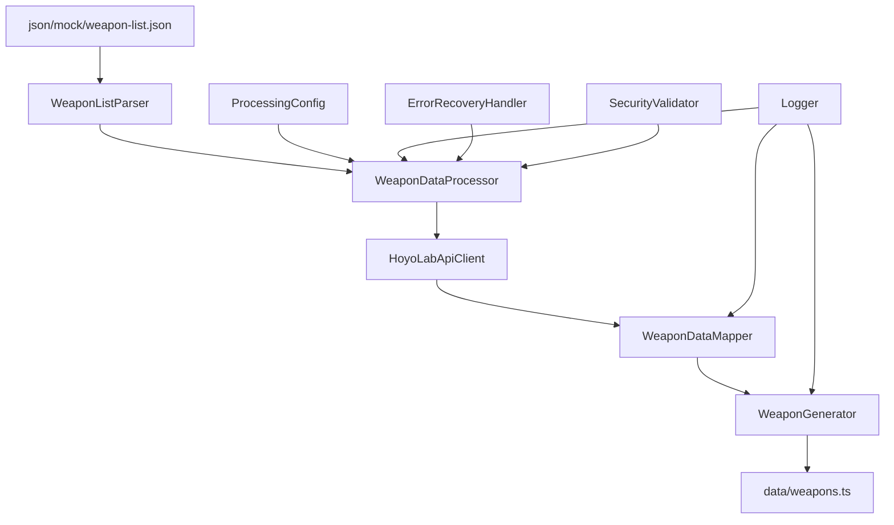

# Design Document

## Overview

音動機（武器）データリストを生成する機能は、既存の ZZZ キャラクターデータ処理システムに統合される新しいコンポーネントです。この機能は、`json/mock/weapon-list.json`から音動機リストを読み込み、HoyoLab API から詳細データを取得して、型安全な`data/weapons.ts`ファイルを生成します。

既存のボンプデータ処理システムのアーキテクチャパターンを踏襲し、レイヤー分離、エラーハンドリング、グレースフル劣化機能を継承します。

## Architecture

### システム構成図



### レイヤー構造

既存のアーキテクチャに従い、以下のレイヤーで構成されます：

1. **Parsers Layer**: `WeaponListParser` - weapon-list.json の解析
2. **Processors Layer**: `WeaponDataProcessor` - ビジネスロジックとデータ変換
3. **Mappers Layer**: `WeaponDataMapper` - API 応答から内部型への変換
4. **Generators Layer**: `WeaponGenerator` - TypeScript ファイル出力
5. **Clients Layer**: 既存の`HoyoLabApiClient`を再利用
6. **Utils Layer**: 既存のユーティリティクラスを活用

## Components and Interfaces

### 1. WeaponListParser

```typescript
export class WeaponListParser {
  /**
   * weapon-list.jsonから音動機エントリーを抽出
   * レア度AとSのみをフィルタリング
   */
  parseWeaponList(filePath: string): WeaponEntry[];

  /**
   * 音動機エントリーの妥当性検証
   */
  validateWeaponEntry(entry: any): ValidationResult;
}

export interface WeaponEntry {
  id: string; // entry_page_id
  name: string; // 日本語名
  rarity: "A" | "S"; // レア度（Bは除外）
  specialty?: string; // 特性（filter_valuesから抽出）
}
```

### 2. WeaponDataProcessor

```typescript
export class WeaponDataProcessor extends DataProcessor {
  /**
   * WeaponEntryからProcessedWeaponDataへの変換
   * 既存のBompDataProcessorパターンを踏襲
   */
  processWeaponData(weaponEntry: WeaponEntry): Promise<ProcessedWeaponData>;

  /**
   * 音動機データの妥当性検証
   */
  validateWeaponData(data: ProcessedWeaponData): ValidationResult;

  /**
   * グレースフル劣化処理
   */
  private attemptGracefulDegradation(
    weaponEntry: WeaponEntry,
    error: any
  ): Promise<ProcessedWeaponData | null>;
}

export interface ProcessedWeaponData {
  basicInfo: BasicWeaponInfo;
  skillInfo: WeaponSkillInfo;
  attributesInfo: WeaponAttributesInfo;
  agentInfo: WeaponAgentInfo;
}
```

### 3. WeaponDataMapper

```typescript
export class WeaponDataMapper extends DataMapper {
  /**
   * API応答から基本武器情報を抽出
   */
  extractBasicWeaponInfo(
    apiResponse: ApiResponse,
    weaponId: string
  ): BasicWeaponInfo;

  /**
   * equipment_skillコンポーネントからスキル情報を抽出
   */
  extractWeaponSkillInfo(modules: Module[]): WeaponSkillInfo;

  /**
   * ascensionコンポーネントから突破ステータスを抽出
   * 「後」の値（配列インデックス1）のみを取得
   */
  extractWeaponAttributes(modules: Module[]): WeaponAttributes;

  /**
   * baseInfoから該当エージェント情報を抽出
   */
  extractAgentInfo(modules: Module[]): WeaponAgentInfo;

  /**
   * 基礎・上級ステータス属性を判定
   * 基礎ステータス：「基礎」が付く項目から「基礎」を除いた属性名（例：基礎攻撃力→atk）
   * 該当データがない場合は適切なデフォルト値を返す
   */
  extractBaseAndAdvancedAttributes(modules: Module[]): {
    baseAttr: Attribute;
    advancedAttr: Attribute;
  };
}
```

### 4. WeaponGenerator

```typescript
export class WeaponGenerator {
  /**
   * ProcessedWeaponDataからWeaponオブジェクトへの変換
   */
  generateWeapon(
    jaData: ProcessedWeaponData,
    enData: ProcessedWeaponData | null,
    weaponId: string
  ): Weapon;

  /**
   * 生成されたWeaponオブジェクトの完全性チェック
   */
  validateWeapon(weapon: Weapon): ValidationResult;

  /**
   * data/weapons.tsファイルの生成
   */
  outputWeaponFile(
    weapons: Weapon[],
    outputPath: string = "data/weapons.ts"
  ): void;
}
```

## Data Models

### Weapon 型定義（Scraping.md に基づく）

```typescript
type Weapon = {
  id: number; // pageId
  name: { [key in Lang]: string }; // 多言語名
  equipmentSkillName: { [key in Lang]: string }; // スキル名
  equipmentSkillDesc: { [key in Lang]: string }; // スキル説明
  rarity: Rarity; // レア度（AまたはS）
  attr: WeaponAttributes; // 突破ステータス
  specialty: Specialty; // 特性
  stats: Stats[]; // 属性配列
  agentId: string; // 該当エージェントID
  baseAttr: Attribute; // 基礎ステータス
  advancedAttr: Attribute; // 上級ステータス
};

type WeaponAttributes = {
  hp: number[]; // 7レベル分（該当データなしの場合は空配列）
  atk: number[]; // 7レベル分（該当データなしの場合は空配列）
  def: number[]; // 7レベル分（該当データなしの場合は空配列）
  impact: number[]; // 7レベル分（該当データなしの場合は空配列）
  critRate: number[]; // 7レベル分（該当データなしの場合は空配列）
  critDmg: number[]; // 7レベル分（該当データなしの場合は空配列）
  anomalyMastery: number[]; // 7レベル分（該当データなしの場合は空配列）
  anomalyProficiency: number[]; // 7レベル分（該当データなしの場合は空配列）
  penRatio: number[]; // 7レベル分（該当データなしの場合は空配列）
  energy: number[]; // 7レベル分（該当データなしの場合は空配列）
};

type Attribute =
  | "hp"
  | "atk"
  | "def"
  | "impact"
  | "critRate"
  | "critDmg"
  | "anomalyMastery"
  | "anomalyProficiency"
  | "penRatio"
  | "energy";
```

### データ抽出パス

#### 基本情報

- **id**: `data.page.id` (数値変換)
- **name**: `data.page.name`
- **rarity**: `filter_values.w_engine_rarity.values[0]`
- **specialty**: `filter_values.filter_key_13.values[0]` → マッピング

#### スキル情報

- **equipmentSkillName**: `modules[equipment_skill].data.skill_name`
- **equipmentSkillDesc**: `modules[equipment_skill].data.skill_desc`

#### 突破ステータス

- **場所**: `modules[ascension].data` (JSON 解析)
- **抽出**: 各レベル（0,10,20,30,40,50,60）の`combatList`から`values[1]`（「後」の値）

#### エージェント情報

- **agentId**: `modules[baseInfo].data.list` → 該当エージェント → `ep_id`

#### 基礎・上級ステータス

- **baseAttr**: `modules[baseInfo].data.list` → 「基礎」が付く項目から「基礎」を除いた属性名を抽出（例：基礎攻撃力 →atk）
- **advancedAttr**: `modules[baseInfo].data.list` → 上級ステータス項目から属性名を抽出

## Error Handling

### エラー分類と対応

1. **ファイル読み込みエラー**

   - weapon-list.json が存在しない
   - JSON 解析エラー
   - 対応: 詳細ログ出力、処理中断

2. **API エラー**

   - レート制限
   - ネットワークエラー
   - 対応: 既存の ErrorRecoveryHandler を活用、リトライ機能

3. **データマッピングエラー**

   - 必須フィールド欠損
   - 型変換エラー
   - 対応: グレースフル劣化、部分的データ保存

4. **レア度フィルタリング**
   - レア度 B の音動機は処理をスキップ
   - ログに除外理由を記録

### グレースフル劣化戦略

```typescript
// 音動機データ取得失敗時のフォールバック
const fallbackWeapon: Partial<Weapon> = {
  id: weaponEntry.id,
  name: { ja: weaponEntry.name, en: weaponEntry.name },
  rarity: weaponEntry.rarity,
  specialty: "attack", // デフォルト特性
  stats: ["physical"], // デフォルト属性
  // 最小限の属性データ
  attr: createDefaultWeaponAttributes(),
};
```

## Testing Strategy

### 単体テスト

1. **WeaponListParser**

   - weapon-list.json 解析の正確性
   - レア度フィルタリング機能
   - 無効データの処理

2. **WeaponDataMapper**

   - API 応答からのデータ抽出
   - 日本語 → 英語マッピング
   - 突破データの「後」値抽出

3. **WeaponGenerator**
   - Weapon オブジェクト生成
   - TypeScript ファイル出力
   - データ検証機能

### 統合テスト

1. **エンドツーエンドデータ処理**

   - weapon-list.json から最終出力まで
   - 実際の API 応答を使用したテスト
   - エラーシナリオのテスト

2. **既存システムとの統合**
   - 共通ユーティリティの動作確認
   - 設定システムとの連携
   - ログ出力の一貫性

### パフォーマンステスト

1. **大量データ処理**

   - 全音動機データの処理時間測定
   - メモリ使用量の監視
   - API レート制限への対応

2. **エラー回復性能**
   - グレースフル劣化の効果測定
   - リトライ機能の性能評価

## Configuration Integration

### ProcessingConfig 拡張

```typescript
interface WeaponProcessingConfig extends BompProcessingConfig {
  weaponListPath: string; // weapon-list.jsonのパス
  outputPath: string; // 出力ファイルパス
  includeRarities: ("A" | "S")[]; // 処理対象レア度
  skipAgentValidation: boolean; // エージェント検証スキップ
  enableSkillExtraction: boolean; // スキル情報抽出の有効化
}
```

### 設定例

```json
{
  "weaponProcessing": {
    "weaponListPath": "json/mock/weapon-list.json",
    "outputPath": "data/weapons.ts",
    "includeRarities": ["A", "S"],
    "batchSize": 10,
    "delayMs": 1000,
    "maxRetries": 3,
    "skipAgentValidation": false,
    "enableSkillExtraction": true,
    "enableValidation": true,
    "logLevel": "info"
  }
}
```

## Performance Considerations

### 最適化戦略

1. **バッチ処理**

   - 音動機データを小さなバッチに分割
   - API レート制限を考慮した遅延制御

2. **メモリ管理**

   - 大きな JSON データの効率的な処理
   - 不要なデータの早期解放

3. **キャッシュ機能**

   - 取得済み API データのキャッシュ
   - 重複リクエストの回避

4. **並列処理**
   - 独立した音動機データの並列処理
   - ワーカープールの活用

### 監視とログ

1. **進捗追跡**

   - リアルタイム進捗表示
   - 処理速度の監視

2. **エラー統計**

   - 成功/失敗率の追跡
   - エラー種別の分析

3. **パフォーマンス指標**
   - 処理時間の測定
   - メモリ使用量の監視
